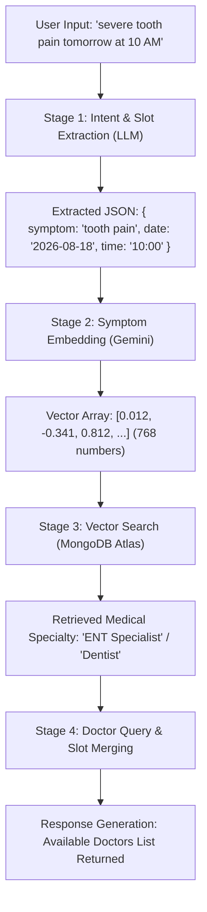

# End-to-End RAG Pipeline Data Flow Documentation

This document explains the complete architecture and step-by-step data flow of our AI Doctor Appointment Booking RAG (Retrieval-Augmented Generation) pipeline.

---

## 📌 Concrete Example Used Throughout This Doc
* **User Input Message:** `"Hi, I've had severe tooth pain since yesterday morning. Can I see someone tomorrow at 10 AM?"`
* **Conversation ID:** `"66b1c8f49a21000000000001"`

---

## 🏗️ High-Level Architecture Overview



---

## 🔄 Phase 0: Offline Pre-Processing (Seeding Knowledge Base)

Before any user sends a message, our medical domain knowledge is vectorized and indexed in MongoDB Atlas.

* **File:** [`seedKnowledgeBase.js`](file:///d:/Portfolio_Project/Backend/scripts/seedKnowledgeBase.js)
* **Model:** [`KnowledgeBase.js`](file:///d:/Portfolio_Project/Backend/models/KnowledgeBase.js)

### Data Transformation:
1. **Raw Document:**
   ```json
   {
     "title": "ENT Guidance",
     "category": "ENT Specialist",
     "content": "Ear, Nose, Throat, and head/neck disorders.",
     "keywords": ["ear pain", "throat infection", "tooth pain", "sinus"]
   }
   ```
2. **Text Concatenation:**
   ```javascript
   textToEmbed = "ear pain throat infection tooth pain sinus Ear, Nose, Throat, and head/neck disorders."
   ```
3. **Embedding Generation:** Passes `textToEmbed` into `getEmbedding()` via `gemini-embedding-2`.
4. **Stored Document in MongoDB `knowledgebases` collection:**
   ```json
   {
     "_id": "66b1a111...",
     "category": "ENT Specialist",
     "content": "...",
     "keywords": [...],
     "embedding": [0.015, -0.339, 0.805, ...] // 768 float values
   }
   ```

---

## 🚀 Phase 1: Real-Time Request Pipeline (Step-by-Step)

### STAGE 1: Request Reception & Conversation State Retrieval
* **File:** [`ragController.js`](file:///d:/Portfolio_Project/Backend/controllers/ragController.js) (Line ~17)
* **Service:** [`conversationService.js`](file:///d:/Portfolio_Project/Backend/services/conversationService.js)

1. Request hits `POST /api/rag/chat` with body:
   ```json
   {
     "conversationId": "66b1c8f49a21000000000001",
     "message": "Hi, I've had severe tooth pain since yesterday morning. Can I see someone tomorrow at 10 AM?"
   }
   ```
2. System fetches or initializes the conversation document from MongoDB:
   ```json
   {
     "status": "collecting_information",
     "intent": null,
     "slots": { "symptom": null, "specialty": null, "date": null, "time": null, "doctorId": null }
   }
   ```

---

### STAGE 2: Structured Intent & Slot Extraction
* **File:** [`extractionService.js`](file:///d:/Portfolio_Project/Backend/services/extractionService.js)
* **Model Used:** Gemini 2.5 / 1.5 Flash (`@google/genai`)

1. The prompt passes the reference date (`toLocaleDateString('en-IN')`) so relative terms like "tomorrow" are resolved dynamically to concrete dates (e.g., `2026-08-18`).
2. Gemini enforces `responseSchema` (`Type.OBJECT`).

* **Output from Gemini (JSON):**
  ```json
  {
    "intent": "book_appointment",
    "symptom": "severe tooth pain",
    "date": "2026-08-18",
    "time": "10:00"
  }
  ```
3. The system merges these new slots into `conversation.slots`.

---

### STAGE 3: Vector Embedding of Extracted Symptom
* **File:** [`embeddingService.js`](file:///d:/Portfolio_Project/Backend/services/embeddingService.js)

1. The system extracts the symptom string: `"severe tooth pain"`.
2. It sends `"severe tooth pain"` to Google Gemini Embedding API (`gemini-embedding-2`).
3. **Output:** A 768-dimensional floating point array:
   ```javascript
   queryVector = [0.012, -0.341, 0.812, -0.091, ... 768 numbers total]
   ```

---

### STAGE 4: Vector Search Retrieval (The "R" in RAG)
* **File:** [`ragService.js`](file:///d:/Portfolio_Project/Backend/services/ragService.js)

1. Executes an aggregation pipeline on MongoDB Atlas `KnowledgeBase` collection using `$vectorSearch`:
   ```javascript
   [
     {
       $vectorSearch: {
         index: "vector_index",
         path: "embedding",
         queryVector: queryVector,
         numCandidates: 10,
         limit: 1
       }
     }
   ]
   ```
2. MongoDB calculates Cosine Similarity between `queryVector` and all indexed database embeddings.
3. **Top Matching Result Retrieved:**
   ```json
   {
     "category": "ENT Specialist",
     "score": 0.912
   }
   ```
4. `conversation.slots.specialty` is automatically set to `"ENT Specialist"`.

---

### STAGE 5: Doctor Availability Lookup & Slot Validation
* **File:** [`doctorService.js`](file:///d:/Portfolio_Project/Backend/services/doctorService.js)

1. The system checks if all required slots are present:
   - `symptom`: `"severe tooth pain"` ✅
   - `specialty`: `"ENT Specialist"` ✅
   - `date`: `"2026-08-18"` ✅
   - `time`: `"10:00"` ✅

2. Since **all slots are filled**, the system queries the `doctors` collection:
   ```javascript
   Doctor.find({ specialization: "ENT Specialist" })
   ```
3. **Database Result:**
   ```json
   [
     { "_id": "doc123", "name": "Dr. Rajesh Sharma", "specialization": "ENT Specialist", "availableSlots": ["10:00-12:00"] },
     { "_id": "doc456", "name": "Dr. Suresh Gupta", "specialization": "ENT Specialist", "availableSlots": ["10:00-12:00"] }
   ]
   ```
4. `conversation.status` transitions from `'collecting_information'` to `'ready_for_doctor_search'`.

---

### STAGE 6: Response Returned to User
* **File:** [`ragController.js`](file:///d:/Portfolio_Project/Backend/controllers/ragController.js)

The controller sends a response back to the client:

```json
{
  "conversationId": "66b1c8f49a21000000000001",
  "message": "We found 2 ENT Specialist(s) available on 2026-08-18 around 10:00:\n- Dr. Rajesh Sharma\n- Dr. Suresh Gupta\nWhich doctor would you like to book with?",
  "state": {
    "intent": "book_appointment",
    "slots": {
      "symptom": "severe tooth pain",
      "specialty": "ENT Specialist",
      "date": "2026-08-18",
      "time": "10:00",
      "doctorId": null
    }
  },
  "status": "ready_for_doctor_search"
}
```

---

### STAGE 7: Doctor Selection & Final Confirmation (Follow-up Turn)
1. **User sends:** `"I want to book with Dr. Rajesh Sharma"`
2. **Controller executes Step 6 logic:**
   - Detects `conversation.status === 'ready_for_doctor_search'`.
   - Matches `"Rajesh Sharma"` against `availableDoctors`.
   - Assigns `conversation.slots.doctorId = "doc123"`.
   - Updates `conversation.status = 'appointment_confirmed'`.
3. **Final Response:**
   ```json
   {
     "message": "Your appointment with Dr. Rajesh Sharma (ENT Specialist) on 2026-08-18 during 10:00 has been successfully confirmed! Booking Ref ID: #doc123",
     "status": "appointment_confirmed"
   }
   ```
